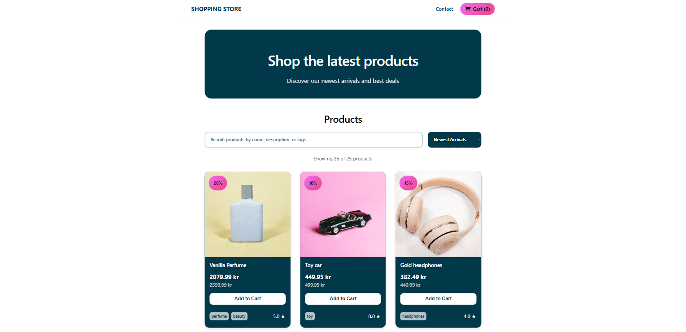

# JavaScript Frameworks

## Shopping Store



An online shop built with React, TypeScript, and Vite.
Users can browse products, search for items, view product details, add items to a cart, and complete a checkout flow.

## Project Background

This project was originally developed for the JavaScript Frameworks course assignment at Noroff. The project was later revisited as part of Portfolio 2, where I reviewed the original implementation and teacher feedback. The focus was on improving functionality, user feedback, accessibility, visual presentation, and cleaning up some of the existing codebase.

## Features

- Product listing using the Noroff Online Shop API
- Product detail pages
- Search by product title, description, and tags
- Sort products by newest and price
- Filter products currently on sale
- Product discount display
- Shopping cart system
- Add to cart feedback
- Quantity controls
- Product reviews with visual star ratings
- Checkout success page
- Contact form with validation
- Responsive design
- TypeScript strict mode

## Tech Stack

- React
- TypeScript
- Vite
- React Router
- CSS Modules
- Noroff Online Shop API

## Portfolio 2 Improvements

As part of Portfolio 2, I revisited the project and made improvements based on testing and previous teacher feedback.

Some of the improvements include:

- Fixed the sale option so that it only displays products currently on sale
- Added user-friendly error handling when products cannot be loaded
- Added visual feedback when a product is added to the cart
- Improved product reviews with visual star ratings and clearer separation between reviews
- Added a shopping cart icon to the navigation
- Updated the browser page title
- Removed unused empty files
- Improved smaller UI and layout details

## API

This project uses the Noroff Online Shop API

## Installation

Clone the repository:

```bash
git clone https://github.com/emmelinlarina/jsfw-2025-v1-emmelin-frameworks-ca.git
```

Install dependencies:

```bash
npm install
```

Start development server:

```bash
npm run dev
```

## Build for Production

```bash
npm run build
```

Preview production build:

```bash
npm run preview
```

## Deployment

The project is deployed using Vercel.

## Pages

- Home
- Product Details
- Cart
- Checkout Success
- Contact

## Contact Form Validation

- Full Name: minimum 3 characters
- Subject: minimum 3 characters
- Email: valid email format
- Message: minimum 10 characters

## Live Site

https://jsfw-2025-v1-emmelin-frameworks-ca.vercel.app/

## GitHub Repository

https://github.com/emmelinlarina/jsfw-2025-v1-emmelin-frameworks-ca

## Author

Emmelin Larina Tvedt Nilsen
